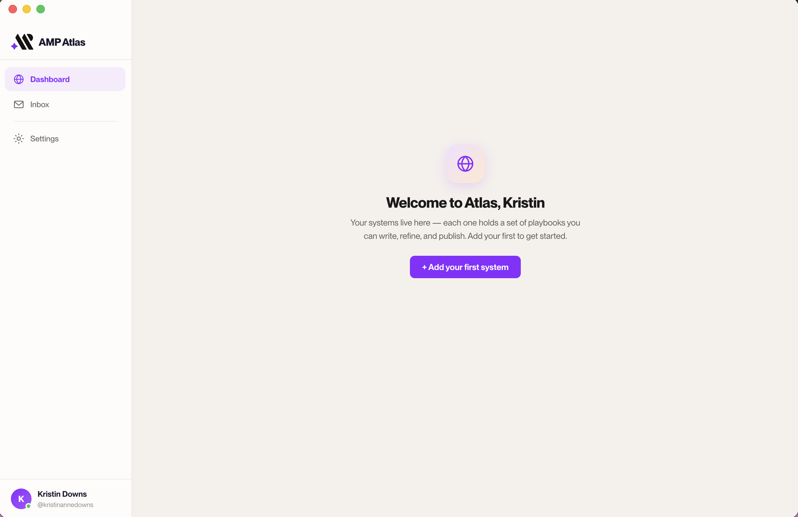

<div align="center">

<picture>
  <source media="(prefers-color-scheme: dark)" srcset="docs/assets/atlas-logo-light.svg">
  
</picture>

# AMP Atlas

**An open, opinionated desktop app for building playbooks and systems the AMP way — on top of GitHub, without the developer vocabulary.**

[](LICENSE)
[](https://github.com/ParrotLab/amp-atlas-releases/releases/latest)
[](#install)

<!-- Drop a product screenshot/GIF at docs/assets/atlas-hero.png (see docs/assets/README.md) -->


</div>

---

## What is Atlas

Atlas is a desktop app that replaces Obsidian and sits on top of GitHub. It's built for non-technical people who want to implement AMP's opinionated framework for building playbooks and systems — without wrestling with branches, commits, and merge conflicts.

> **Drafts** instead of branches. **Save** instead of commit. **Publish** instead of push. The same git workflow underneath — no developer vocabulary on the surface.

## Why Atlas (and why it's open)

AMP is a methodology company, not a software company. Atlas isn't a product we're selling — it's an opinionated *enabler* for the way we teach people to build with AI. The usual path (Obsidian plus raw GitHub) is clunky and gets in the way; Atlas makes the methodology easy to actually do.

That's why it's open source. **Use it, fork it and make it your own, or contribute back to make it better.** This is not SaaS — there's no lock-in and no account required to own your work. Your content lives in your own GitHub repos, in plain Markdown, forever.

## Install

Atlas ships as a desktop app. Grab the latest build from **[Releases](https://github.com/ParrotLab/amp-atlas-releases/releases/latest)**:

| Platform | Download |
|---|---|
| macOS (Apple Silicon) | [Download `.dmg`](https://github.com/ParrotLab/amp-atlas-releases/releases/latest) |
| macOS (Intel) | Not yet built — [build from source](#build-from-source) |
| Windows | Not yet built — [build from source](#build-from-source) |

Atlas auto-updates from the public releases feed. If macOS blocks the first launch, right-click the app and choose **Open** — see the [Getting Started guide](docs/user-guides/01-getting-started/welcome.md).

## How it works

Atlas is a thin, friendly layer over real git:

- Each **System** is one of your GitHub repos, on your machine.
- You write in a clean Markdown editor with a frontmatter properties drawer.
- **Save** commits, **Publish** opens a pull request, **Review** shows the diffs and approvals.
- Everything stays versioned and traceable in GitHub — Atlas just hides the plumbing.

Sign-in is GitHub OAuth (device flow) — no `gh` CLI and no manual tokens.

## Documentation

User guides live in **[`docs/user-guides/`](docs/user-guides/README.md)**:

- [Getting started](docs/user-guides/01-getting-started/welcome.md)
- [Core concepts](docs/user-guides/02-core-concepts/operating-model.md)
- [Everyday workflows](docs/user-guides/03-everyday-workflows/editing-basics.md)
- [Reference & troubleshooting](docs/user-guides/04-reference/troubleshooting-faq.md)

*A hosted docs site is on the roadmap.*

## Contributing

Contributions are welcome — Atlas is meant to be built on. Start with **[CONTRIBUTING.md](CONTRIBUTING.md)** and browse the [open issues](https://github.com/ParrotLab/amp-atlas/issues).

### Build from source

```bash
git clone https://github.com/ParrotLab/amp-atlas.git
cd amp-atlas/app
npm install
npm run dev      # launch the app with hot reload
```

Requirements: Node 18+. Produce a production package with `npm run build`.

## Tech stack

- **Electron** + **electron-vite** (build / hot reload)
- **React 19** + react-router (HashRouter)
- **TipTap 3** editor
- **simple-git** for repo operations; **GitHub REST API** + OAuth device flow for pull requests
- **gray-matter** (frontmatter), **turndown** + **markdown-it** (HTML <-> Markdown)
- Storage: `localStorage` for settings; your filesystem and GitHub for everything else (no database)

## Roadmap & issues

Track work, file bugs, and suggest ideas in **[Issues](https://github.com/ParrotLab/amp-atlas/issues)**.

## License

[MIT](LICENSE) © Parrot Lab (AMP - AI Momentum Protocols). Fork it, ship it, make it yours.

## Acknowledgments

Built on [Electron](https://www.electronjs.org/), [TipTap](https://tiptap.dev/), [simple-git](https://github.com/steveukx/git-js), and the broader open-source community.
