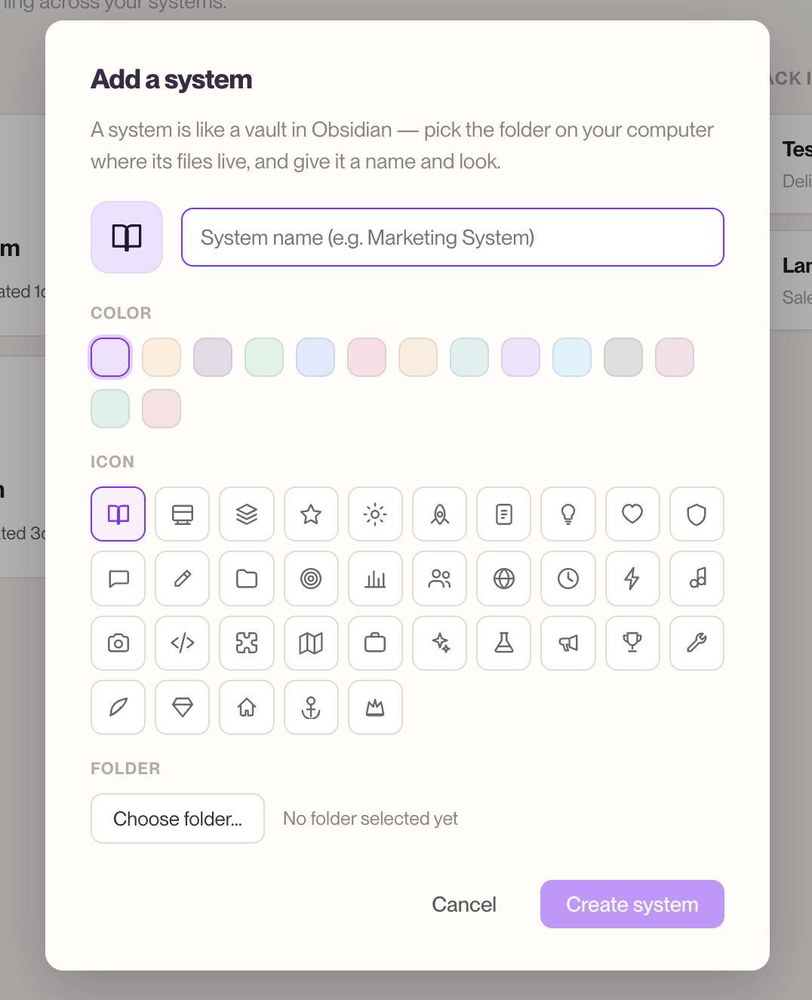
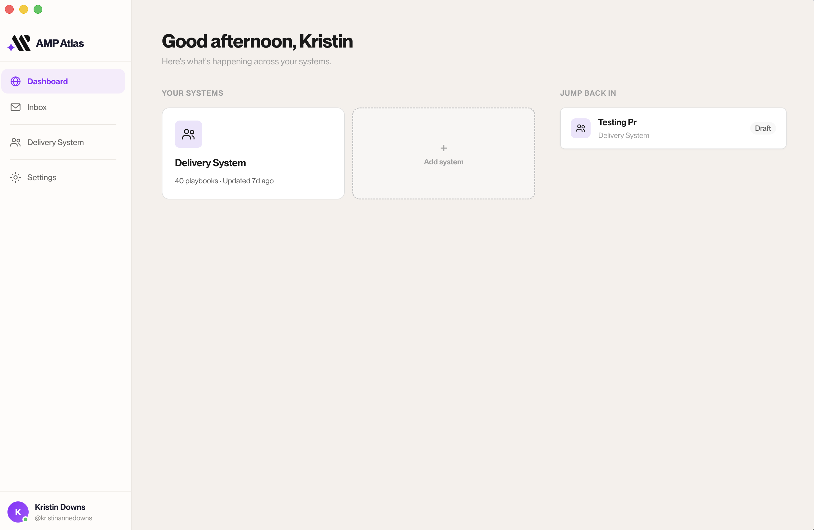

# Set up your account & your first System

This guide gets you from "just installed AMP Atlas" to "looking at my first System." It
takes about five minutes, and there's nothing technical to configure.

---

## Before you start: your System folders are already set up

One thing to know up front: in this version of AMP Atlas, your team's Systems **already
exist** as folders on your computer, set up ahead of time. Your job is to **connect** AMP
Atlas to those folders — not to build them.

So "adding a System" here means *"point AMP Atlas at a System that's already on my
computer,"* not *"create a brand-new System from scratch."* (Creating a fresh System from
inside the app is planned for later — for now, your team lead sets new Systems up for you.)

If you don't yet have a System folder on your computer, you have two options: ask your team
lead — they'll get it onto your machine first — or put it there yourself by following
[Get your first System onto your computer](./getting-your-system-folder.md). Either way,
once the folder's on your Mac you come back here and connect to it.

---

## 1. Install and open AMP Atlas

Download AMP Atlas and open it like any other app on your Mac.

> _Notes: AMP Atlas is an internal app, so it isn't in a public app store — ask your team
> lead for the download. It currently runs on macOS._

The first time you open it, AMP Atlas asks you to connect your account before you can do
anything else. That's the next step.

---

## 2. Connect to GitHub

AMP Atlas keeps your team's work safe and reviewable using GitHub behind the scenes — but
you'll never have to *use* GitHub directly. You just need to connect your account once so
AMP Atlas can act on your behalf.

1. Click **Connect to GitHub**.
2. AMP Atlas shows you a short code (it's **copied to your clipboard automatically**) and
   opens your web browser to a GitHub page.
3. Paste the code and approve the connection in the browser. **If you're part of a team, be
   sure to select the organization your Systems live in** when GitHub asks — that's what lets
   AMP Atlas reach your team's repositories.
4. Come back to AMP Atlas — you're connected.

*The Connect screen you see on first launch.*

That's it. You won't have to do this again on this computer. (If your connection ever drops
later, AMP Atlas won't kick you out — your local work keeps running, and you just click
**Connect to GitHub** again in **Settings** to reconnect. There's also a **Sign out** button
in Settings if you ever need it.)

> **Why GitHub?** It's the trusted engine that gives AMP Atlas its version history and
> review powers. Connecting is a one-time click, and from then on it's invisible.

---

## 3. Add your first System

Now connect AMP Atlas to a System that's already on your computer. You can start this from:

- the **Add system** tile on your dashboard, or
- **Settings → + Add System**.

*Adding a System: give it a name, color, icon, and point it at its folder.*

You'll be asked for a few things:

- **A name** — what this System is called, like "Delivery System."
- **A color and icon** — so you can spot it at a glance on your dashboard.
- **A folder** — the folder on your computer where this System's files already live.

Pick the folder your System lives in, and AMP Atlas connects to it. Everything already in
it shows up right away, ready to work with.

> **The folder needs to be a connected System already.** It must be a folder your team set
> up and that's linked to GitHub. Also make sure you pick the **top folder of the System**,
> not a folder *inside* it — pointing AMP Atlas at a sub-folder won't work either. If the
> folder isn't a connected System, AMP Atlas will let you know with a clear message rather
> than adding it. When in doubt, ask your team lead which folder to choose.

> **Already use Obsidian?** A System folder works just like an Obsidian vault — in fact, you
> can point AMP Atlas at the same folder and use both.

---

## 4. You're in

Once you've added a System, it appears on your **dashboard** as a card, showing its status
and how many playbooks it has. Click it to open it up and look around.

*Your connected System, ready to open.*

From here, a good next move is the [tour of the app](./app-tour.md) so you know where
everything is — or dive straight into [editing basics](../03-everyday-workflows/editing-basics.md)
if you'd rather learn by doing.

---

**You should now have:** AMP Atlas installed, your account connected, and at least one
System showing on your dashboard. If your System card is there, you're set.

---

### Trouble connecting?

- **The browser didn't open, or the code expired.** Just click **Connect to GitHub** again
  to get a fresh code.
- **You approved in the browser but AMP Atlas still says "not connected."** Return to the
  AMP Atlas window and give it a moment; if it doesn't update, try connecting once more.
- **AMP Atlas won't add my folder.** That usually means the folder isn't a System connected
  to GitHub yet. Check with your team lead that you picked the right folder.
- **Still stuck?** See [Troubleshooting & FAQ](../04-reference/troubleshooting-faq.md) or ask
  your team lead.
