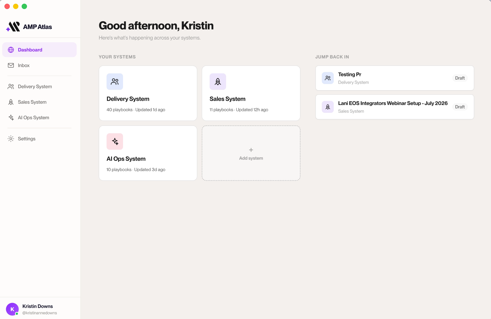
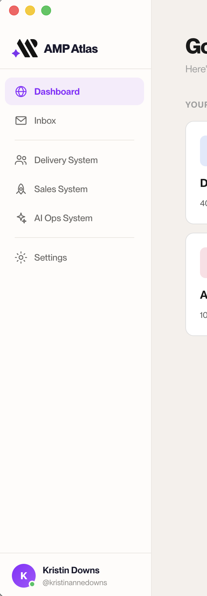
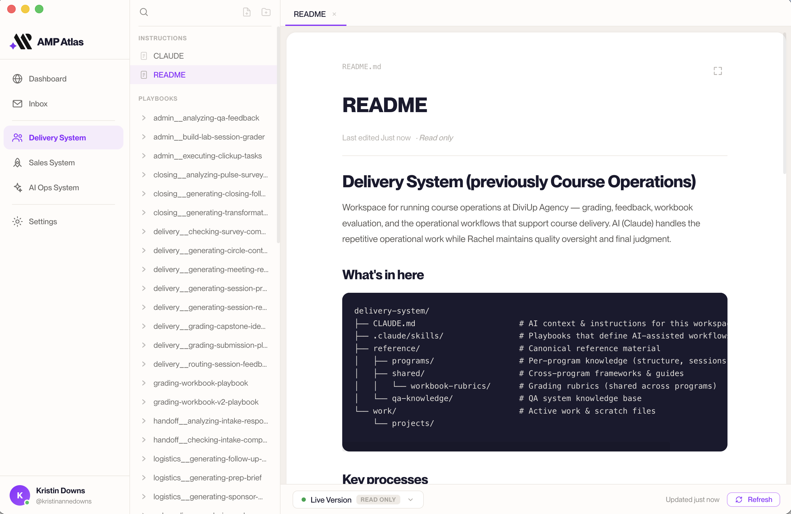
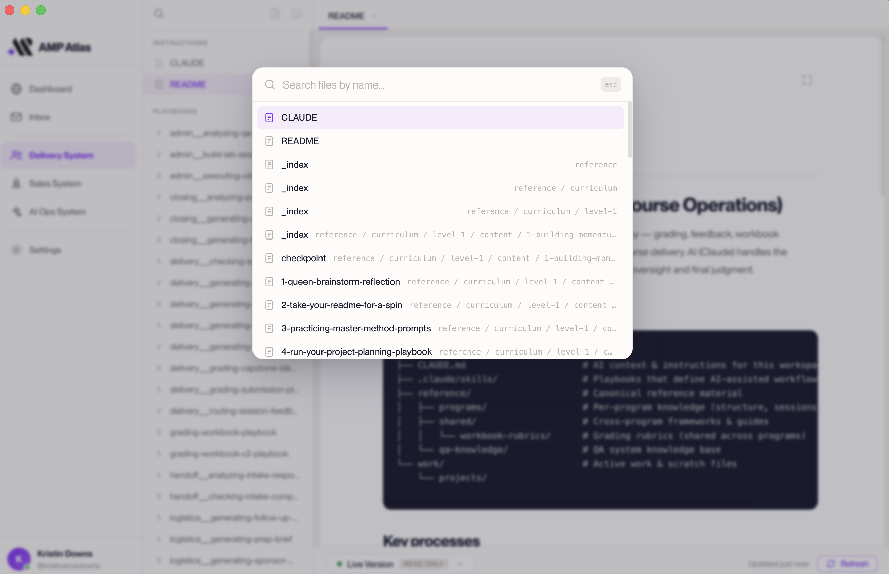
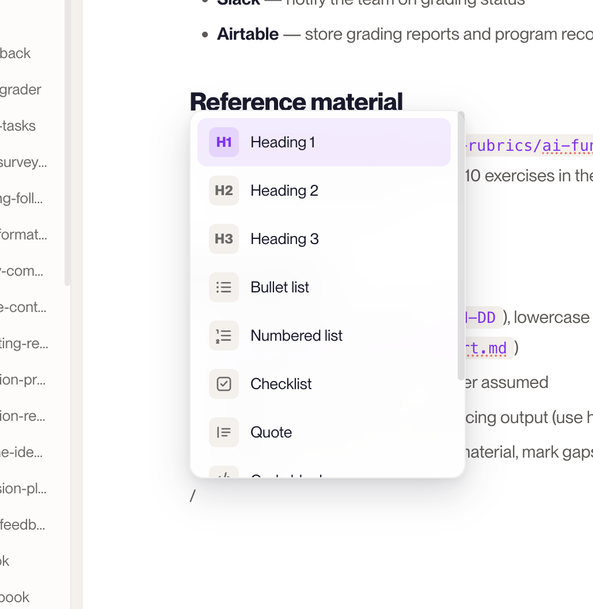
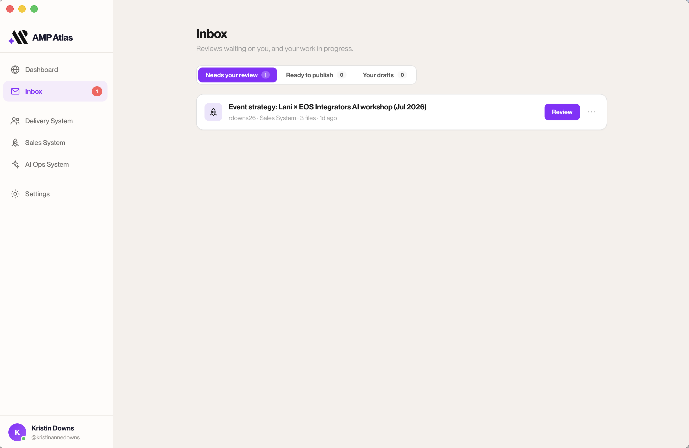
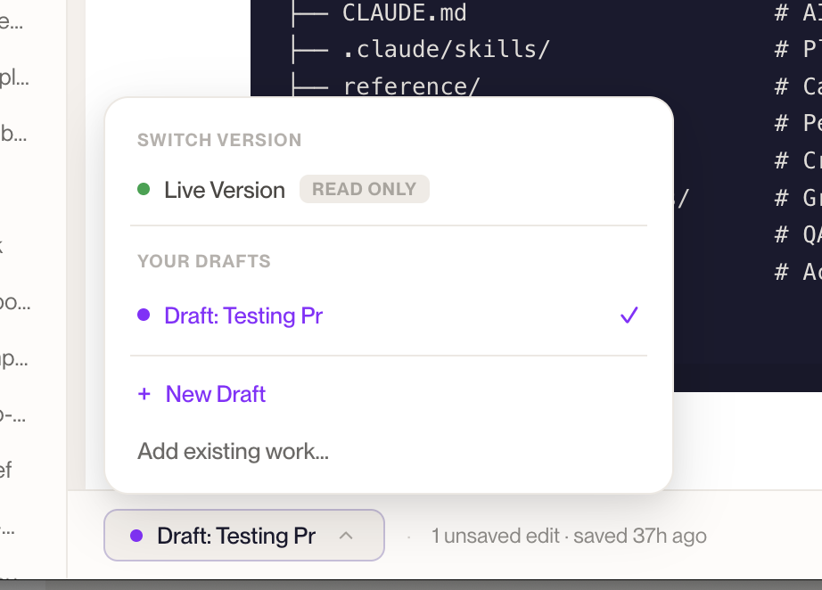

# A tour of the app

Let's get you oriented. AMP Atlas has just a few main areas, and once you know them,
you'll always know where you are.

---

## The dashboard — your home base

When you open AMP Atlas, you land on the **dashboard**. This is your home screen, laid out
in two columns:

- **Your systems** (the main column) — one card per System, in the color and icon you
  chose. Each card shows the System's **status** (like "Up to date," "Not connected," or a
  count of unpublished changes) and **how many playbooks** it has. Click a card to open that
  System. There's also an **Add system** tile here for connecting a new one.
- **Jump back in** (the right rail) — the pieces of work you've got going, so you can pick
  up where you left off. Each entry points to one of your **Drafts**, with its System and a
  status badge.

Whenever you want to get back to neutral ground, the dashboard is home.

*The dashboard: your Systems, plus what you can jump back into.*

---

## The sidebar — moving around

The **sidebar** runs down the side of the app and is always there. It contains:

- **Dashboard** — back to your home base.
- **Inbox** — reviews and actions waiting on you (more below). It shows a count when there's
  something for you.
- **Each of your Systems**, listed individually — click one to jump straight into it.
- **Settings** — manage your Systems and your account (and where you'd add a new System or
  reconnect).

At the bottom, you'll see your own name and avatar.

*The sidebar is always there for moving between areas.*

> _Adding a System isn't a sidebar item — you do it from the **Add system** tile on the
> dashboard, or from **Settings**. See [Set up your first System](./account-and-first-system.md)._

---

## Inside a System — the file tree and editor

When you open a System, you'll see its contents laid out as a **file tree** — the folders
and documents that make up that System, organized in the [standard shape](../02-core-concepts/folder-structure.md).

- Click any document to open it in the **editor**, where you read and write.
- Right-click in the tree to create new files and folders, or use the **+** on a folder to
  start a new playbook, project, or sub-system from a template.

The editor is a clean, friendly writing space — no code, no clutter. There's more on it in
[Editing basics](../03-everyday-workflows/editing-basics.md).

*Inside a System: the file tree and the editor.*

### Two handy shortcuts

- **Quick file search (⌘K or ⌘P).** Press it anywhere in a System to pop open a search box
  and jump to any file by name — faster than hunting through the tree.
- **The "/" menu.** While editing, type **`/`** on a new line to insert things like
  headings, lists, checklists, quotes, tables, and dividers, without any formatting know-how.

*⌘K (or ⌘P) jumps you to any file by name.*

*Typing "/" inserts headings, lists, tables, and more.*

---

## The Inbox — what needs your attention

The **Inbox** is your action list, organized into a few tabs so you always know what's on
you:

- **Needs your review** — Drafts a teammate has asked *you* to look over.
- **Ready to publish** — your own Drafts that have been approved and are ready for you to
  make official.
- **Your drafts** — your Drafts that are in review or waiting on your changes.

Each item has a clear next action. Reviewing is covered in
[Reviewing someone else's work](../03-everyday-workflows/review-someones-work.md); publishing
in [Submitting your work for review](../03-everyday-workflows/submit-for-review.md).

*The Inbox groups your actions into three tabs.*

---

## The status bar — where you are right now

At the bottom of a System's editor, a **status bar** keeps you oriented while you work. It
shows:

- **Which version you're in** — a switcher reading either **Live Version** (with a green dot
  and a **Read only** pill) or **Draft: {name}** (with a violet dot). Click it to switch
  between Drafts, create a new Draft, or bring in existing work.
- **On a Draft:** whether you have unsaved edits ("N unsaved edits" vs "all changes saved"),
  plus a **Save** button (which can also **Submit for review** or **Discard**).
- **On the Live Version:** when it was last updated, plus a **Refresh** button to pull in the
  latest.

*The status bar's version switcher tells you where you are.*

It's a quick glance to answer "where am I, and is everything current?" — no need to go
digging.

> **A note on the Live Version:** when you're viewing a System's Live Version, the editor is
> **read-only** — you can look but not change it (you'll see the "Read only" pill). That's by
> design: the Live Version is official, so edits always happen in a Draft. To make changes,
> switch to or create a Draft from the status bar (see
> [Editing basics](../03-everyday-workflows/editing-basics.md)).

---

**You should now recognize** the dashboard, the sidebar, a System's file tree and editor,
the quick-search and "/" shortcuts, the Inbox tabs, and the status bar — enough to find your
way around without getting lost. Next: [Editing basics](../03-everyday-workflows/editing-basics.md).
