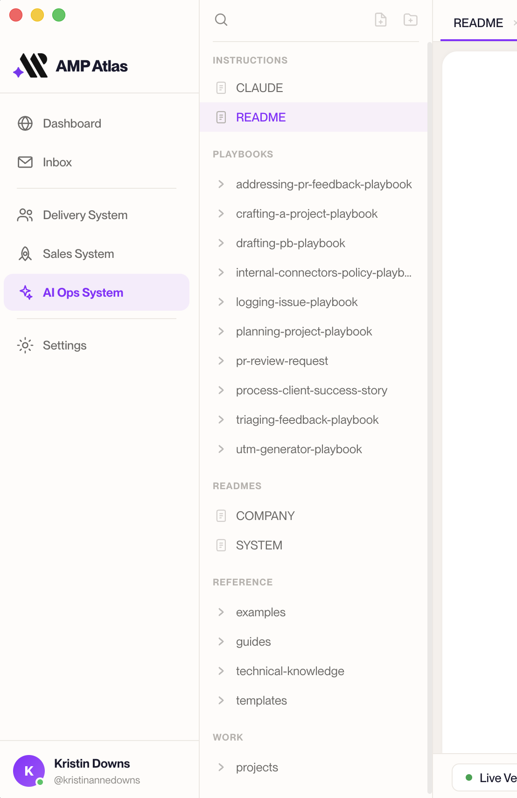

# Intro to the AMP folder structure

Every System in AMP Atlas is organized the same way. That's on purpose — and once you
know the shape, you'll always know where to find things, and where new things should go.

This guide is your map.

---

## The shape is a promise

Here's the key idea: **every System follows the same structure**, so if you're looking
for something, it's always in a predictable place. You never have to relearn how to get
around when you open a new System.

It's the same reason a well-organized kitchen works for anyone who walks in: plates are
in the cupboard, silverware is in the drawer, food is in the fridge. You don't have to
memorize *this particular* kitchen — you already know the pattern. AMP Atlas Systems work
the same way, and that consistency is what lets both you and Claude find your way around
instantly.

---

## The one split that matters most: Reference vs. Work

Before the specific folders, understand the single most important distinction in any
System:

- **Reference** is **canonical** — approved, trusted, and used to do the work. Finished
  rubrics, guides, templates, official frameworks. If it's in Reference, your team (and
  Claude) treats it as true.
- **Work** is **in-flight** — active projects, drafts, and things still being shaped.
  Not yet official.

Why the split matters: if a half-finished draft sat right next to the approved version,
nobody — human or Claude — would know which one to trust. Keeping Work separate from
Reference is what keeps the canonical material reliable.

> A quick test whenever you're deciding where something goes: **"Is this finished and
> official, or still being worked on?"** Finished and official → Reference. Still being
> worked on → Work.

---

## The pieces of a System

Here's what you'll find inside a System, and what each part is for:

| Part | What lives here |
|------|------------------|
| **Overview** | A plain-language description of what this System is and who looks after it. The front door. |
| **Long-form context** | Background docs that are too big for the overview — company context, how this System relates to others. |
| **Playbooks** | The repeatable processes this System can run (for a person or for Claude). |
| **Reference** | The canonical, approved material — the trusted source of truth. |
| **Work → Projects** | Active and past project work: the in-progress stuff. |
| **Sub-systems** | The smaller areas a large System is divided into. |

You mostly spend your time in two of these: **Projects** (when you're doing a piece of
work) and **Reference** (when you're looking something up or updating the official
material).

---

## An example System

Here's roughly what a System looks like inside. Don't worry about every line — just get a
feel for the shape:

```
Delivery System
├── Overview                      ← what this System is, who owns it
├── Long-form context             ← company + system background
├── Playbooks                     ← repeatable processes
│   ├── Triaging the support inbox
│   └── Grading a session
├── Reference                     ← ✅ canonical, approved material
│   ├── Rubrics
│   ├── Templates
│   └── Program knowledge
└── Work                          ← 🚧 in-progress material
    └── Projects
        └── Onboarding email refresh
            ├── Braindump          ← raw early thinking
            ├── Pitch              ← the case for the work
            └── (your working files and results)
```


*The same shape as it appears in AMP Atlas's file tree. (Optional screenshot.)*

Notice how a **Project** starts you off with a **Braindump** (raw thinking) and a
**Pitch** (the case for the work), and then you add your working files and finished
results alongside them as the project grows. That progression is covered in the
[Templates guide](../04-reference/01-templates-guide.md).

---

## What not to worry about

A few reassurances:

- **You won't break anything by looking around.** Opening and reading files is always
  safe.
- **The overall System shape is already set up for you.** Systems come pre-built with the
  right top-level shape (Reference, Work, Playbooks, and so on) — you connect to them, you
  don't have to build them. And when you add a new **Playbook**, **Project**, or
  **Sub-system** *inside* a System, AMP Atlas lays out the right starter pieces for you from
  a template (see the [Templates guide](../04-reference/01-templates-guide.md)).
- **Not every System looks identical inside Reference.** The outer shape is always the
  same, but what's *inside* Reference is tailored to what each System actually does — a
  Delivery System and a Marketing System will naturally hold different material.

---

**You should now be able to** open any System and know where to find its playbooks, its
trusted Reference material, and its in-progress Project work — and know the difference
between "official" (Reference) and "in-progress" (Work). Next, let's actually do some
work: [Editing basics](../03-everyday-workflows/01-editing-basics.md).
