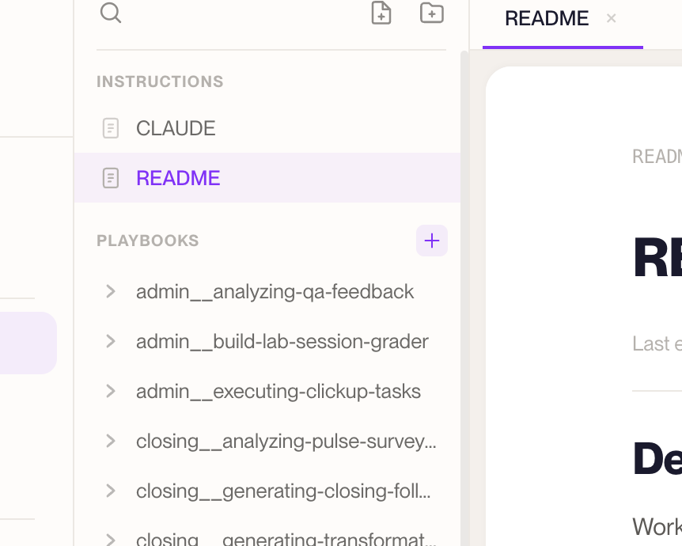
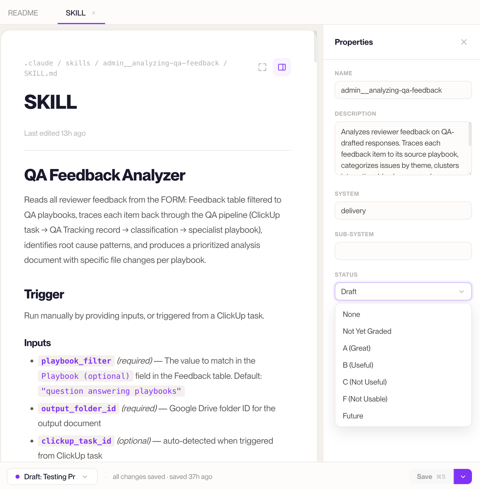

# Editing basics

This is the everyday stuff: opening a document, making changes safely, and saving your
work. Once you've got this, everything else in AMP Atlas builds on it.

---

## First: you edit in a Draft, not the Live Version

Here's the one rule that shapes all editing in AMP Atlas: **you never edit the Live
Version directly.** The Live Version is official and shared, so it stays read-only. All
your changes happen in a **Draft** — your private, safe working copy.

So when you want to change something, the first step is to be in a Draft:

- If you're viewing the Live Version (you'll see the **Read only** pill in the status bar),
  open the version switcher in the status bar and **create a new Draft** — or switch into an
  existing one.
- If you're already in a Draft, you're good to go.

The status bar always tells you which Draft you're in. If the editor won't let you type,
it's almost always because you're looking at the Live Version — switch to a Draft and you're
off.

> Don't overthink this. A Draft is cheap and safe. Making one is the normal way to start any
> change, and nothing you do in it affects anyone until it's reviewed and published.

---

## Opening and reading documents

Open any System from your dashboard or the sidebar, and you'll see its **file tree**. Click
a document to open it in the editor. Reading is always safe — click around, explore, follow
your curiosity. You can't break anything by looking.

> **Tip:** press **⌘K** (or **⌘P**) anywhere in a System to search your files by name and
> jump straight to one.

---

## Writing and formatting

The editor is a clean, friendly writing space. There are **three ways to format** — use
whichever feels natural, or mix them:

- **Type shortcuts as you go.** If you're comfortable with Markdown, just type it: `#` for a
  big heading, `##` for a smaller one, `-` for a bullet, `>` for a quote, `**bold**`, and so
  on. The editor turns it into formatting automatically.
- **Highlight and pick.** Select some text and a little **bubble menu** pops up with bold,
  italics, links, and more — great when you don't want to remember any shortcuts.
- **Use the "/" menu.** On a new line, type **`/`** and choose what to insert — Heading,
  Bullet list, Numbered list, Checklist, Quote, Code block, Table, or Divider.

None of these require any technical know-how — pick the one that fits how you like to work.

---

## Creating new documents and folders

There are two ways to add something new:

- **Right-click in the file tree** where you want it, and choose **New file** or **New
  folder**. It appears right where you clicked.
- **Use the New file / New folder buttons** at the top of the file tree, by the search bar.
  These open a small window where you name the item and then choose where it goes — you can
  drill down into any folder to drop it exactly where you want.

Either way, you name it and it's created. A plain new file starts blank.

### Starting from a template

Some things are better started from a template than a blank page. In the file tree, the
**+** button on a System's main folders creates the right kind of item, already structured:

- **New playbook** (in the Playbooks area) — a repeatable process.
- **New project** (in the Work area) — a scoped piece of work, started with a *pitch* and a
  *braindump*.
- **New sub-system** (in the Reference area) — a new area within the System.

Each comes pre-filled with helpful prompts to replace. See the
[Templates guide](../04-reference/templates-guide.md) for what each one gives you and when
to use it.


*The "+" on a System folder starts the right template.*

---

## Properties (mostly on playbooks)

Some documents carry a small set of **properties** — labeled details shown in the
**properties** panel when the document is open. Today these appear on **playbooks** (the
`SKILL.md` file for a playbook), and there are five of them:

- **Name** — what the playbook is called.
- **Description** — a short summary of what it does and when to run it. This is important:
  it's how Claude knows when a playbook is the right one to use, so keep it clear and specific.
- **System** — which System this playbook belongs to.
- **Sub-system** — which area within the System it belongs to, if any.
- **Status** — a **quality grade** showing how proven the playbook is: _Not Yet Graded_,
  _A (Great)_, _B (Useful)_, _C (Not Useful)_, _F (Not Usable)_, or _Future_. It tells your
  team (and Claude) how much to trust that playbook.

Fill these in from the properties panel when a playbook is open. Keeping the **Description**
and **Status** accurate matters most — they're what help both people and Claude use the
playbook well. Most other documents simply show "No properties for this file," and that's fine.


*A playbook's Status grade lives in the properties panel.*

---

## Save, then later submit and publish

A quick map of the steps, because they're distinct:

- **Save** keeps your progress **inside your Draft**. It makes sure nothing is lost. It does
  **not** make anything official, and nobody else sees it. Save early, save often (**⌘S**).
- **Submit for review** sends your finished Draft to a teammate to check. (This is one of the
  options on the Save button, or from the status bar.)
- **Publish** is the final step — after your Draft is approved, *you* publish it to become
  the new **Live Version**. More on both in
  [Submitting your work for review](./submit-for-review.md).

So your everyday rhythm is: work in a Draft, **Save** as you go, and — when it's ready —
submit it for review, then publish once it's approved.

```
   work in a Draft  ──▶  Save (as often as you like)  ──▶  submit for review  ──▶  approved  ──▶  Publish
       (private)          (nothing official yet)          (a teammate checks)               (now official)
```

---

**You should now be able to** open a document, start a Draft to make changes safely, write
and format text (including the "/" menu), create new files and template-based items, read a
playbook's status, and understand how **Save**, **submit**, and **Publish** differ. Next,
the fun part: [coworking with Claude](./coworking-with-claude.md).
